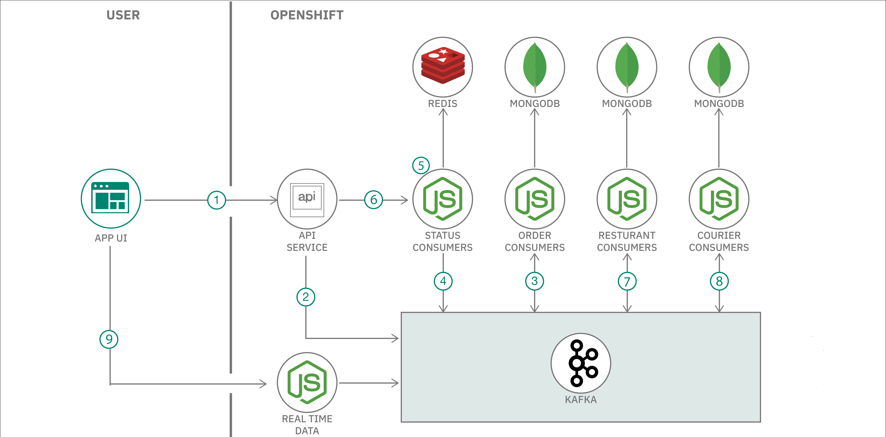
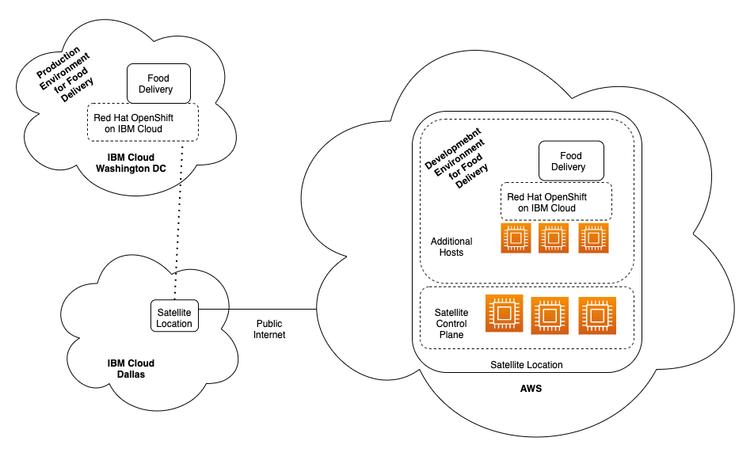

For this demonstration, we will leverage a sample Food Delivery application. Food Delivery is a cloud native, microservices-based application leveraging multiple  cloud native open source projects to develop a simulated version of an UberEATS/Grub Hub type business. The application uses Kafka, Redis, and MongoDB.

In this IBM Cloud Satellite demonstration, you will create development and production deployments for the Food Delivery application as illustrated in the diagram below. The application runs on Red Hat OpenShift on IBM Cloud. The Satellite Location in AWS will act as the development environment for the application, while production will be in the IBM Cloud data center in Washington, D.C.

**Note:** The production environment is not in a Satellite Location. This illustrates the ability of IBM Cloud Satellite to manage applications not only in Satellite Locations, but also other non-Satellite locations simply by registering the OpenShift cluster with IBM Cloud Satellite. Registering a cluster in this manner is achieved by granting the cluster administrator role to the to the IBM Cloud Satellite Config service. This step has already been performed, but you can learn more about it <a href="https://cloud.ibm.com/docs/satellite?topic=satellite-satcon-existing " target="_blank">here</a>.

## History and Reference

This set of assets is based on the material used at the Digital Developer Conference: Hybrid Cloud Labs and the IBM Cloud Community Days Conference. You can reference details on the workshops here: https://anthonyamanse.gitbook.io/ibm-satellite-workshop/.

The base application itself was developed by Yan Koyfam and Anthony Amaranse and published here: https://github.com/IBM/scaling-apps-with-kafka. It was later modified to remove the dependance on Confluent, another open source project. Other contributors include Dave Tropeano and Julie Nash.
