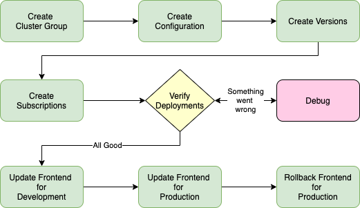

During this demonstration, you will perform the following tasks.  

- Create cluster groups for development and production environments
- Create a configuration for the Food Delivery application
- Create versions to
  - Deploy Kafka, Mongo, and Redis backends
  - Deploy backend microservices
  - Deploy 2 versions of the application front end
- Create subscriptions for the cluster groups and versions
- Verify deployment of the application components
- Change the frontend to a new version for development environment
- Change the frontend to a new version for production environment
- Rollback the production environment to the original front end

Remember, the IBM Cloud Satellite Location in AWS has already been provisioned. In addition, two Red Hat OpenShift on IBM Cloud clusters have been provisioned, one in the Satellite Location and one in another IBM Cloud datacenter. An OpenShift namespace (aka project) has already been created for you in each of the clusters. You will be working in this namespace: **##CONFIGURATION.namespace##**.

If the deployments fail when subscriptions are added, you will need to debug the issue. In most cases, the problem will be in the YAML that was used for the selected version. If the YAML is correct, open the OpenShift web console for the cluster with the failure and review the event log and logs for the deployed pods.

How you orchestrate a demonstration for a client will depend on how much time you have for the demonstration, the audience, and your comfort level with the underlying technologies. For instance, if you have a very limited amount to time, you may create the versions before you start the demonstration to save time. If you have a more technical audience, you may want to describe the content of the YAML files that are used. As you walk through the steps in the next section, consider how you would customize the demonstration based upon time, audience, etc.

[< Prev](01.02%20The%20Food%20Delivery%20Application.md) || [Next >](01.04%20Watch%20the%20demonstration.md) 
