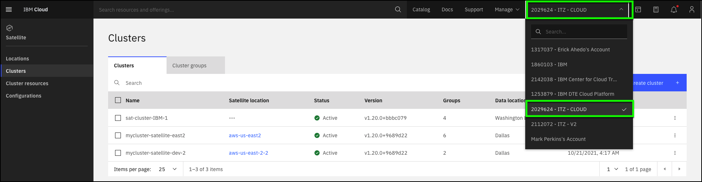
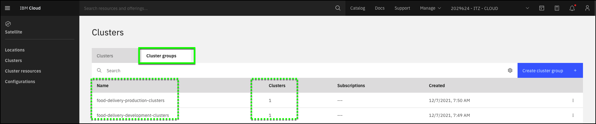

The cluster group specifies all Red Hat OpenShift on IBM Cloud clusters that you want to include into the deployment of your Kubernetes resources. The clusters can run in your Satellite location or in IBM Cloud. You can learn more about creating cluster groups <a href="https://cloud.ibm.com/docs/satellite?topic=satellite-setup-clusters-satconfig#setup-clusters-satconfig-groups" target="_blank">here</a>.

**For this demonstration, the two cluster groups have already been created for you. If you were building the environment in your own account, you would need to create these cluster groups. This is a simple 2 step process of creating a Cluster Group name and adding one or more Red Hat OpenShift Clusters to the Cluster group.**

**In the steps below, verify the cluster groups have been created and each is assigned a cluster.** 

1. Open the IBM Cloud portal to the Satellite-Clusters page:
  <a href="https://cloud.ibm.com/satellite/clusters" target="_blank">https://cloud.ibm.com/satellite/clusters</a>
  
2. Change from your IBM Cloud account to the **##ACCOUNT.shortid## - ##ACCOUNT.name##** account.

**Note:** If your browser window is narrow, you may see this icon:  instead of the current account name as shown in the screen capture above.

**Note:** You may need to refresh the browser page or repeat step 1 after switching accounts to **##ACCOUNT.shortid## - ##ACCOUNT.name##**.

3. Click the **Cluster groups** tab.

4. Verify the **food-delivery-development-clusters** and **food-delivery-production-clusters** groups exist and each has 1 cluster assigned.

[< Prev](01.04%20Watch%20the%20demonstration.md) || [Next >](03.01%20Create%20a%20configuration.md) 
