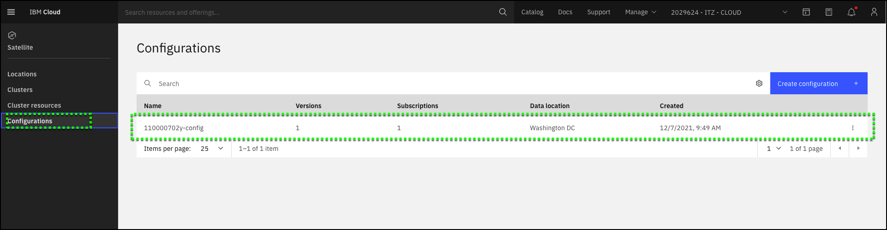

**Configurations** allow you to upload or create Kubernetes resource YAML file **versions** that you want to deploy to one or more Red Hat OpenShift clusters. Once you create **versions**, the Kubernetes resources can be deployed by adding a **subscription** to your **configuration**. The **subscription** specifies the **version** to be deployed and the target **cluster group**.

In this demonstration environment, a **Configuration** has already been created for you. Your configuration name is: **##CONFIGURATION.config##**. 

1. If you closed the IBM Cloud portal after the previous step, open the IBM Cloud portal to the Satellite-Clusters page: <a href="https://cloud.ibm.com/satellite/configuration" target="_blank">https://cloud.ibm.com/satellite/configuration</a>

2. Verify your **Configuration** is created. 

**Note:** The image below will show a different configuration name.  Verify the **##CONFIGURATION.config##** configuration exists.

[< Prev](gotoLink|02.01) || [Next >](gotoLink|03.02) 
