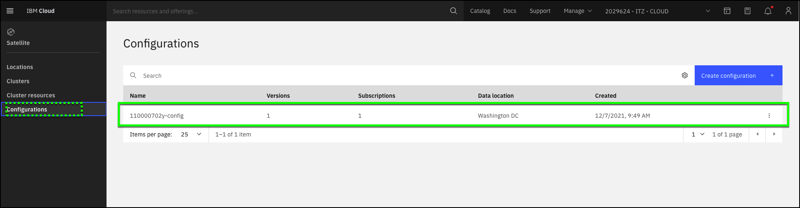
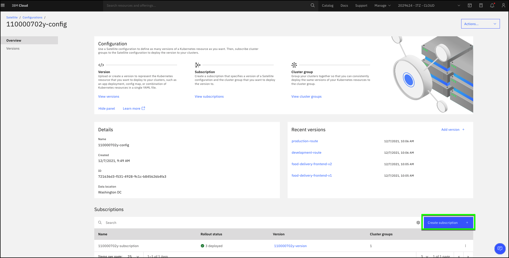
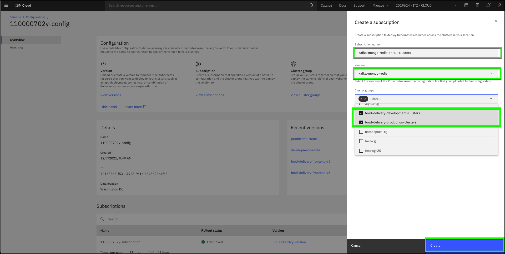
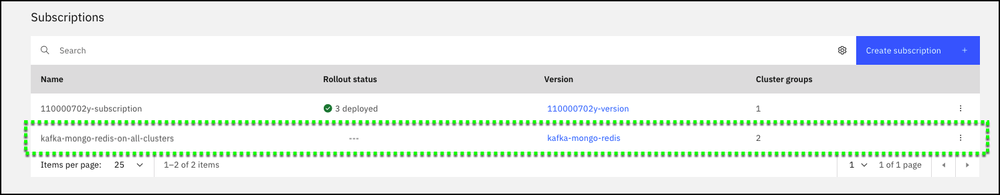
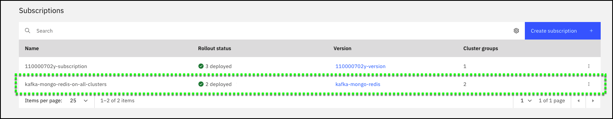
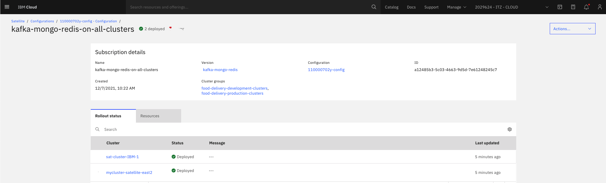
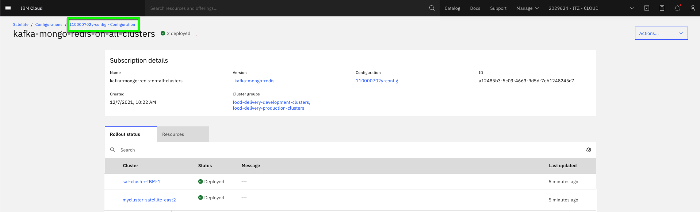
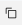
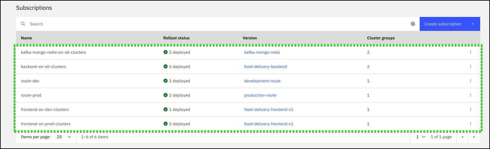

Now that the Configuration and Versions have been created, the next step is to create **Subscriptions** for the Food Delivery application. In total, six **Subscriptions** will be created:


|**Subscription name**              | **Version**               | **Cluster group(s)**               |
|-----------------------------------|---------------------------|------------------------------------|
| kafka-mongo-redis-on-all-clusters | kafka-mongo-redis         | food-delivery-production-clusters<br>food-delivery-development-clusters|
| backend-on-all-clusters           | food-delivery-backend     | food-delivery-production-clusters<br>food-delivery-development-clusters|
| frontend-on-dev-clusters          | food-delivery-frontend-v1 | food-delivery-development-clusters |
| frontend-on-prod-clusters         | food-delivery-frontend-v1 | food-delivery-production-clusters  |
| route-dev                         | development-route         | food-delivery-development-clusters |     
| route-prod                        | production-route          | food-delivery-production-clusters  | 

These **Subscriptions** will use the **Versions** you created to deploy the code to the selected OpenShift clusters. 

1.  If you closed the IBM Cloud portal after the previous step, open  the IBM Cloud portal to the Satellite Configurations page: <a href="https://cloud.ibm.com/satellite/configuration" target="_blank">https://cloud.ibm.com/satellite/configuration</a>.

2. Click the **##CONFIGURATION.config##** configuration.



3. Click the **Create subscription +** button on the Overview page under Subscriptions.



Note: Do NOT delete any existing subscriptions! These are used to create the OpenShift namespace you will be using in this demonstration. Deleting them will break the demonstration.

4. Create the **kafka-mongo-redis-on-all-clusters** subscription.

Use the following values for the **Create a subscription** dialog:

**Subscription name**
```clipboard
kafka-mongo-redis-on-all-clusters
```
**Version**
```
kafka-mongo-redis
```
**Cluster groups**
```
food-delivery-production-clusters
food-delivery-development-clusters
```



5. Click **Create** for the **kafka-mongo-redis-on-all-clusters** Subscription.

6. Verify the **kafka-mongo-redis-on-all-clusters** is created and deployed.

Immediately after clicking create, notice the new Subscription appears in the **Subscriptions** table.



Shortly afterwards, if there have been no issues, the **Rollout status** changes from **---** to **2 deployed**. 
**Note:** if the status doesn't update automatically, click the page refresh button of your browser.



7. Click the **kafka-mongo-redis-on-all-clusters** entry in the table and view the Subscription details.



8. Click the **##CONFIGURATION.config##** link to return to the configuration page.



9.  Repeat the above process (steps 3 thru 8) for each of the remaining subscriptions.

|**Subscription Name**                    | **Version**               | **Cluster group(s)**                 |
|----------------------------|---------------------------|--------------------------------------|
| backend-on-all-clusters    | food-delivery-backend     | food-delivery-production-clusters <br>food-delivery-development-clusters |
| frontend-on-dev-clusters   | food-delivery-frontend-v1 |  food-delivery-development-clusters  |
| frontend-on-prod-clusters  | food-delivery-frontend-v1 |  food-delivery-production-clusters   |
| route-dev                  | development-route         |  food-delivery-development-clusters  |     
| route-prod                 | production-route          |  food-delivery-production-clusters   | 

To avoid typographical errors, use the  to copy the values below and paste into the **Subscription name** field.
```clipboard
backend-on-all-clusters
```

```clipboard
frontend-on-dev-clusters
```

```clipboard
frontend-on-prod-clusters
```

```clipboard
route-dev
```

```clipboard
route-prod
```

10. Verify all **Subscriptions** are created and deployed.



**Note:** in the next step you will access the Red Hat OpenShift portal to further verify the application has been deployed. You will also access the application and make updates to it using the **food-delivery-frontend-v2** version.


[< Prev](gotoLink|03.02) || [Next >](gotoLink|03.04) 
