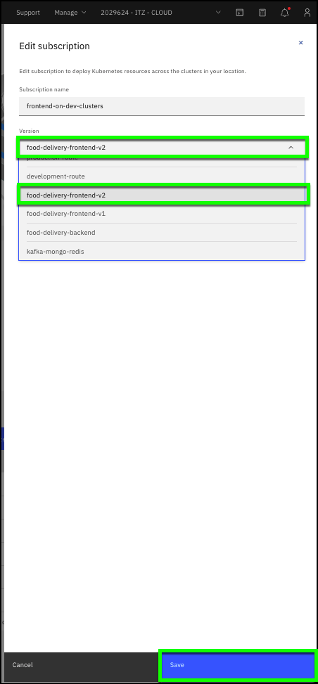

Now the Food Delivery application is deployed, running, and verified. As we all know, today's applications never stay static. Development teams add new functions, backend business processes change, and bugs are fixed. This is where the power of IBM Cloud Satellite configurations, versions, and subscriptions come alive. To illustrate this, in the next few sections you will demonstrate a typical application flow. You will update the Food Delivery frontend in development, and then deploy that new frontend to the production environment. 

1.  Open the IBM Cloud portal to the Configurations overview page: <a href="https://cloud.ibm.com/satellite/configuration" target="_blank">https://cloud.ibm.com/satellite/configuration</a>.

2. Click the **##CONFIGURATION.config##** configuration link.


3. Edit the **frontend-on-dev-clusters** Subscription.


4. Change the Version for the subscription to use the **food-delivery-frontend-v2** and click **Save**.

```clipboard
food-delivery-frontend-v2
```



5. Verify the **Rollout status** is updated.


**Note:** Remember how to get to this screen? Click the **frontend-on-dev-clusters** link in the Subscriptions table. Verify the **Last updated** field has a recent  value (for example: 0 minutes ago).

6. Verify the new frontend has been deployed to the development environment.

There are several ways to verify the new frontend has been deployed. The simplest is to refresh the browser page for the application you opened earlier. Remember, you just updated the development environment. You will notice the application is now using a **dark mode** user interface. If you no longer have the application running in your browser, you can access it by repeating step eight in [03.04 Verify the application is deployed](gotoLink|03.04).


The capabilities of the application are the same, but the user interface has changed. This was accomplished by using a new **container image** for the application that was specified in the **food-delivery-frontend-v2** version YAML.

Frontend v1 YAML specification:
```console
    spec:
      containers:
        - image: anthonyamanse/example-food-frontend:1.0.ddc
          name: example-food
          imagePullPolicy: Always
          ports:
            - containerPort: 8090
```

Frontend v2 YAML specification:
```console
    spec:
      containers:
        - image: anthonyamanse/example-food-frontend:2.0.ddc
          name: example-food
          imagePullPolicy: Always
          ports:
            - containerPort: 8090
```

Another way to see that the application was changed by the subscription is to view the event log in the OpenShift web console for the development cluster. There you will see that one of the example-food pods was deleted and a new one started.

7. Repeat steps 2 thru 6 to deploy the **food-delivery-frontend-v2** version to the **frontend-on-prod-clusters** subscription.
