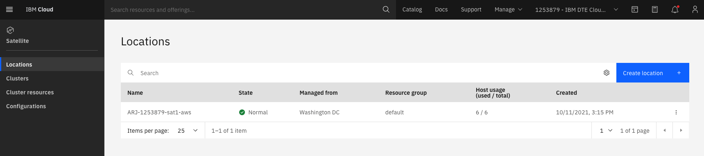

A Satellite Location is a representation of an environment in your infrastructure provider, such as an on-premises data center or public cloud, that you want to bring IBM Cloud services to so that you can run workloads in your own environment. 

Creating a Satellite Location can be achieved through the IBM Cloud Portal, via the IBM Cloud Satellite command line interfaces or APIs. You create the location based off at least three separate zones of your infrastructure environment and attach host machines from across these zones in your infrastructure to the location.  For other public cloud providers, IBM Cloud Satellite provides automation via <a href="https://cloud.ibm.com/docs/schematics?topic=schematics-about-schematics" target="_blank">IBM Cloud Schematics</a> to setup the Location.  For on-premises deployments, scripts are provided that will need to be run on the target host machines. 

You can directly access the Satellite Locations in IBM Cloud Portal through this link: <a href="https://cloud.ibm.com/satellite/locations" target="_blank">https://cloud.ibm.com/satellite/locations</a> Below is a screen capture of the IBM Cloud Portal Satellite Locations page with a single Location defined. **Note:** the physical location of the Satellite Location is not an attribute of the Location. You should reflect the physical location in the Satellite Location name.

To learn more about Satellite Locations, refer to the Satellite Location product documentation: <a href="https://cloud.ibm.com/docs/satellite?topic=satellite-locations" target="_blank">https://cloud.ibm.com/docs/satellite?topic=satellite-locations</a>. 

**Note:** there are many requirements associated with creating a Satellite Location including:
- minimum host requirements
- network latency between Satellite Location hosts and IBM Cloud data centers
- and others.

[< Prev](gotoLink|01.03) || [Next >](gotoLink|02.02) 
