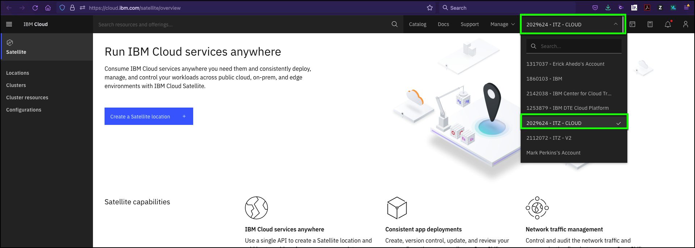
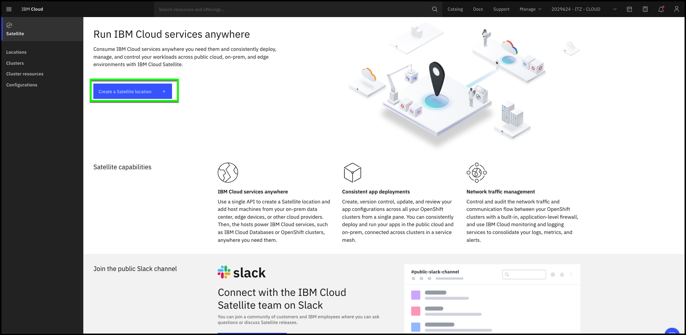
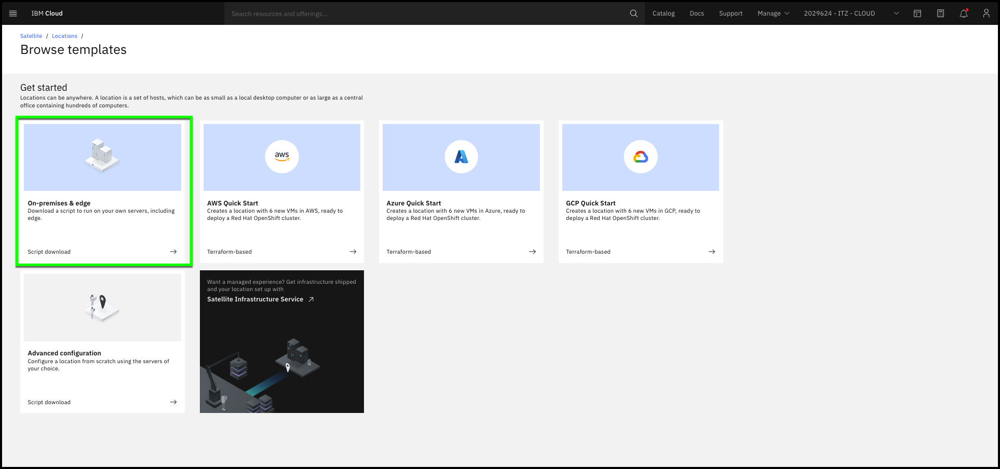
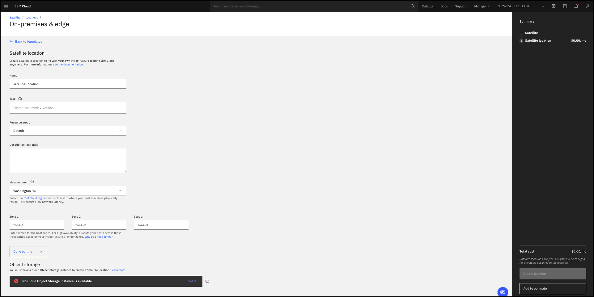
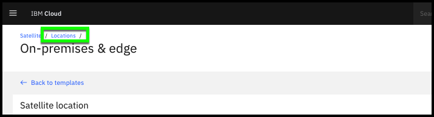
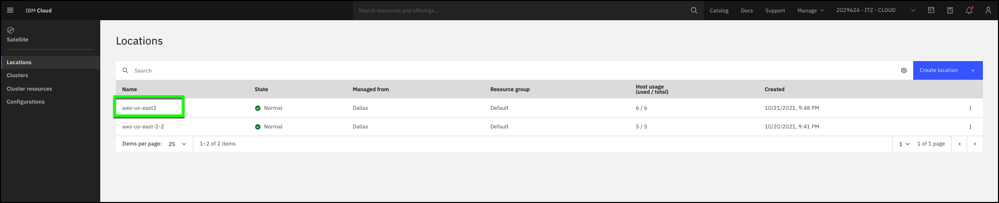
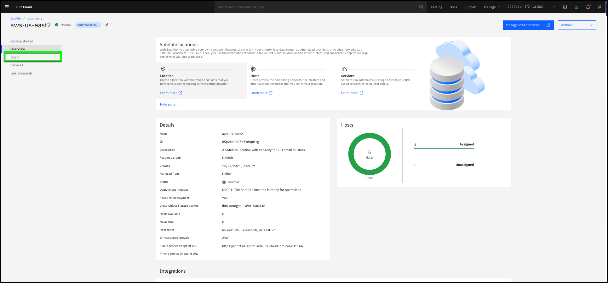
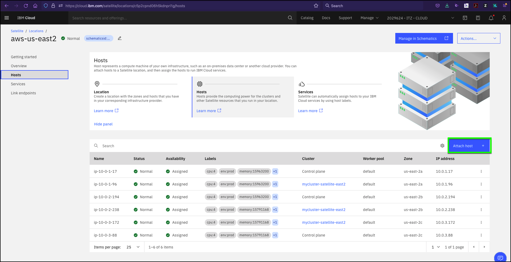
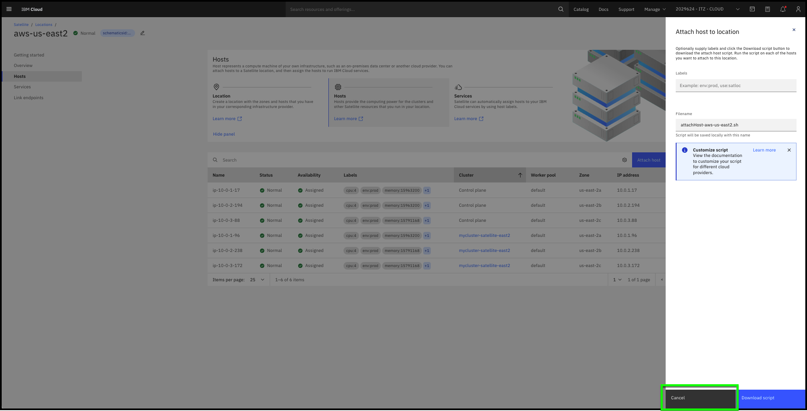

Demonstrating how to provision IBM Cloud Satellite may be of interest to some audiences, but this activity is typically done only a couple of times by a client and is usually performed by their technical team. This demonstration does not illustrate the real business value of IBM Cloud Satellite. It is included in this asset for completeness. If you have limited time to perform a live demonstration, you may want to briefly cover this process and move on to some of the other demonstrations described in later demonstrations.

There are several approaches you can take in doing an actual demonstration of the provisioning process of a Satellite Location.  

1. Play the video in the previous chapter to the client. It includes both narration and annotations.  
2. Use the raw video (below) from the previous chapter and provide your own narration to the video. You will want to pause the video at appropriate locations based upon your narration and any questions your client may have.

**Note:** This video has no sound and is intended to be played while you narrate. Also, the IBM Cloud portal and even the IB Cloud Satellite product changes regularly. You may notice some differences between the video and the actual user interface and experience you see today.

<iframe src="https://video.ibm.com/embed/recorded/131143792?autoplay=false&html5ui=0" style="border: 0;" webkitallowfullscreen allowfullscreen frameborder="0" width="720" height="405" referrerpolicy="no-referrer-when-downgrade"></iframe> 

**Note:** If the video appears blurry, click the HD button at bottom right and select "1080p @ 390kbps HD". To view the video in full screen in Firefox, hover in the video player and click the  icon. To view the video in full screen in Safari, click the  icon.

3. Alternatively, you could also do this demonstration using the IBM Cloud portal up to the point of clicking the "Create location" button. You can then switch to the location view of an already provisioned location and describe what took place during the provisioning process. This "baking show" approach shows all the steps but avoids the delays that would be required to perform actual provisioning and deployment of resources. 

**Note:** you will not have the AWS credentials to input in the portal to provision an AWS Location. For this type of demo, you can use the "On-premises & edge" location template instead of the AWS template and describe the differences based upon what you saw in the provisioning video.

The steps below can be used as a guide for this style of demonstration:

**Access the IBM Cloud Satellite overview page in the IBM Cloud portal**

1. Launch the IBM Cloud portal: <a href="https://cloud.ibm.com/satellite/overview" target="_blank">https://cloud.ibm.com/satellite/overview</a>.

**Note:** The IBM Cloud Portal will be opened in a new browser tab. You need to switch between this tab and the new tabs to accomplish many of the lab tasks. You may want to open the new tabs in new windows and display both browser windows at the same time. You may need to disable pop-up blockers if you do not see the new tabs. Also, Firefox and Safari browsers are recommended as the image quality of screen captures when viewed in Chrome are sub-optimum.

2. Change from your IBM Cloud account to the **##ACCOUNT.shortid## - ##ACCOUNT.name##** IBM Cloud account.

**Note:** If your browser window is narrow, you may see this icon:  instead of the current account name as shown in the screen capture above.

**Note:** You may need to refresh the browser page or repeat step 1 after switching accounts to **##ACCOUNT.shortid## - ##ACCOUNT.name##*.

3. Click **Create a Satellite Location**.

4. Describe the **Location templates** page.

Sample dialog: IBM Cloud Satellite Locations can be anywhere. IBM provides templates for several public cloud providers like AWS, Microsoft, and Google. The public cloud provider templates automate the provisioning of the remote compute, memory, and storage resources. Once the servers are provisioned, the automation deploys the IBM Cloud Satellite control plane software, configures the environment, and puts it under the management of IBM Cloud site reliability engineers (SREs).

5. Click the **On-premises & edge** tile.
6. Click the **Edit**  link.

Sample dialog: For on-premises deployments or to other public cloud providers, the process has a few more manual steps. You will want to provide a descriptive name and any tags to better identify the Location. You will also need to select the **Managed from** location. This is the IBM Cloud data center that will be used to manage the Satellite Location. You will want to select the IBM Cloud data center that is nearest to your Satellite Location as there are latency requirements. In addition, you can specify the names of availability zones within your Satellite Location. Ideally, you will provision servers in separate physical zones to provide high availability to your cloud services. And finally, you will need to provide an IBM Cloud Object Storage instance that will be used for backups of the IBM Cloud Satellite control plane. Once that is complete, you click "Create location". This will create a script that you will then need to download, install, and run on each of the servers in the Satellite Location. The script will download the IBM Cloud Satellite control plane software, install, configure, and put the Satellite Location under IBM's control.

7. Click the **Locations** link at top left of screen.

Sample dialog: Once the Satellite Location is fully deployed, you can access the details of the Location. Here you see the current Satellite Locations that have been deployed, their state, and additional information. Let us look at the details of one of these.

8. Click **##SATELLITE.location##**. 

**Note: the actual Satellite Location details may differ from the screen capture above. You will want to adjust your dialog to what you see.**

Sample dialog: Here we see the details and status of our Satellite Location. Notice we have 6 hosts at this Location, and they are all currently in the "assigned" state. Typically, when a Satellite Location is first provisioned, you will see 3 hosts assigned and the others in the unassigned state. The first 3 hosts are used for the IBM Cloud Satellite control plane. Additional hosts are used to deploy IBM Cloud Services like managed Red Hat OpenShift or IBM Cloud Databases. 

9. Click **Hosts**. 

**Note: the hosts details page may differ from the screen capture above. You will want to adjust your dialog to what you see.**

Sample dialog: Here we see the details for each host that has been deployed at our Satellite Location. Notice the **Status** and **Availability** fields. Sort the table by clicking the **Cluster** menu item in the table header. In this Location, we see that we have our 3 Control plane hosts and the other 3 are used by a Red Hat OpenShift cluster.

10. Click the **Attach host** button.

Sample dialog: If we want to add **additional** hosts to the Satellite Location, we can do so by going here and specifying the tags we want to use to label the host and then downloading the configuration script. At this time, there is not automation for adding **additional** hosts to an existing Location, so we will need to provision the hardware, download the configuration script, and run the script. Once complete, the host will be moved under IBM management and appear as a new host at our Location in a "unassigned" state.

11. Click **Cancel**.

Sample dialog: That is a brief overview of how to provision an IBM Cloud Satellite Location. We will cover services, link endpoints, and other IBM Cloud Satellite capabilities later. Any questions?
